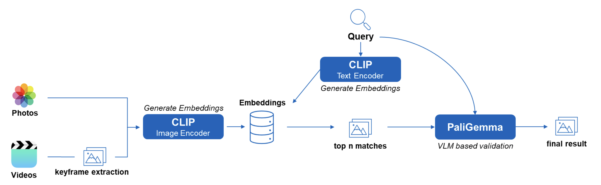
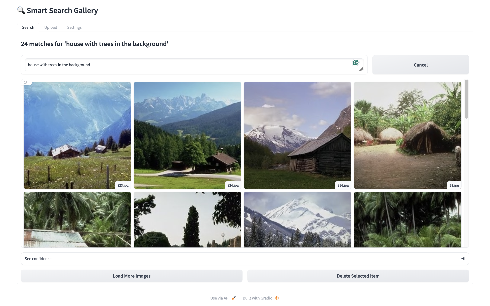

# Smart Search Gallery

[](https://opensource.org/licenses/MIT)
[](https://www.python.org/downloads/)
[]()

This project is a multimodal smart search engine for local media, enabling semantic search across both photos and videos. It uses a hybrid, two-stage search architecture to combine the speed of embedding-based retrieval with the contextual accuracy of a Vision Language Model (VLM). This brings powerful, content-aware search capabilities to your desktop computer.

## How It Works

The search process is designed for both speed and accuracy:

1.  **Fast Retrieval (CLIP):** All media, including keyframes extracted from videos, are indexed using CLIP embeddings. A text query is used to perform a rapid similarity search, returning the most visually relevant candidates.

2.  **Precise Validation (PaliGemma):** The top results from CLIP are then analyzed by the PaliGemma VLM. This stage verifies the semantic context of the query. For example, for "a monkey wearing a hat," it filters out images that contain only a monkey or a hat, returning only those where the relationship is correct.

This hybrid approach ensures that you get accurate results without having to wait for a full VLM analysis of your entire gallery.

The diagram below illustrates the data flow from query to final result.



## Demo

The Gradio UI showing validated results for the query "house with trees in the background."



## Getting Started

1.  Clone the repository and navigate into the project directory:
    ```bash
    git clone https://github.com/hartmann-simon/smart-search-gallery
    cd smart-search-gallery
    ```

2.  Create and activate a virtual environment:
    ```bash
    python3 -m venv .venv
    source .venv/bin/activate
    ```

3.  Install the required packages:
    ```bash
    pip3 install -e .
    ```

4.  Create a `.env` file from the example and add your credentials and paths:
    ```bash
    cp .env_example .env
    ```
    You will need to edit the `.env` file:
    ```text
    HF_TOKEN=your_hugging_face_token
    GALLERY_PATH=/path/to/your/image/folder
    MODEL_SERVER_PORT=5000
    GRADIO_PORT=7864
    ```
    A Hugging Face token is required. First, [create a Hugging Face account](https://huggingface.co), then request access on the [model card for `google/paligemma-3b-pt-224`](https://huggingface.co/google/paligemma-3b-pt-224). Finally, navigate to your account **Settings -> Access Tokens** to create and copy your token into the .env file.

5.  Start the model server and wait for it to load:
    ```bash
    python3 src/server/model_server.py
    ```

6.  In a new terminal, start the Gradio UI:
    ```bash
    python3 src/ui/gradio_app.py
    ```

## Performance Considerations

Performance is highly dependent on hardware, especially for the VLM validation stage.

-   **Hardware:** A modern GPU is recommended for a smooth experience. The system is functional on a MacBook Air (M4, 16GB) but super slow! A laptop with an NVIDIA GTX 1660 Super or better provides a more responsive experience.
-   **Batch Size:** To manage memory usage, the Gradio UI includes a setting to adjust the VLM batch size. Use a small batch size (1-3) on systems with limited RAM/VRAM to prevent errors, and a larger size (10-30) on powerful machines to increase speed.
